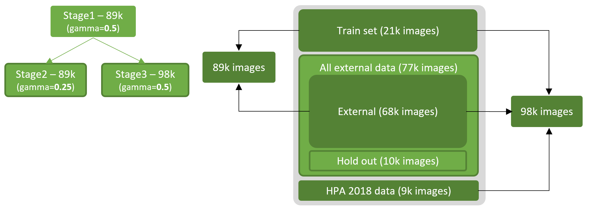

# Human Protein Atlas - Single Cell Classification - 2021
[HPA 2021](https://www.kaggle.com/c/hpa-single-cell-image-classification/leaderboard) solution - Source code documentation

**Dependencies:**
- [Pytorch](https://pytorch.org) 1.7.1+
- [Timm](https://github.com/rwightman/pytorch-image-models) 0.4.5+
- [Albumentations](https://github.com/albumentations-team/albumentations) 0.5.2+
- [Iterative stratification](https://github.com/trent-b/iterative-stratification) 0.1.6
- [HPA Segmentation](https://github.com/CellProfiling/HPA-Cell-Segmentation) 0.1.7 (only for inference)


**Data:**

Download HPA data and generate HDF5 files:
- image_512.hdf5 (21k images – [trainset](https://www.kaggle.com/c/hpa-single-cell-image-classification/data) – 512x512RGBY – 89.3GB)
- image_external_512.hdf5 (68k + 10k images – [public external](https://www.kaggle.com/lnhtrang/hpa-public-data-download-and-hpacellseg) – 638.5GB)
- image_additional_512.hdf5 (9k images – [HPA 2018](https://console.cloud.google.com/storage/browser/kaggle-human-protein-atlas) – 37.2GB)

With the following script:

```hdf5_dump.py --images_folder ./train/images/ --hdf5_output ./data/train/images_512.hdf5```

```hdf5_dump.py --images_folder ./public_external/images/ --hdf5_output ./data/train/image_external_512.hdf5```

```hdf5_dump.py --images_folder ./2018/images/ --hdf5_output ./data/train/image_additional_512.hdf5```

HDF5 dump is recommended to speed up training. 512x512 RGBY images are generated once and re-used multiple times accross trainings. It should take around 24h to 36h depending on your hardware. It required around 1TB free disk space.

Related CSV with images identifiers and labels are available in [data/](data/) folder:
- train_cleaned_default_external.csv
- train_cleaned_2018.csv
- meta_cleaned_default_external.csv (only for OOF)
- holdout.csv (only for OOF)

**Training:**

Update ```HOME```,  ```DATA_HOME``` and ```TRAIN_HOME``` in ```hpa_inference.py``` if needed.

- Stage 1: Train SEResNeXt50 backbone with 89k images (train set + external):
  ```python hpa_training.py --seed 2020 --factory HDF5 --backbone seresnext50_32x4d --gamma 0.50 --labels_file train_cleaned_default_external.csv```
 
- Stage 2: Train SEResNeXt50 backbone with 98k images from stage 1 weights (train set + external + 2018):
  ```python hpa_training.py --seed 2020 --factory HDF5 --backbone seresnext50_32x4d --gamma 0.50 --labels_file train_cleaned_default_external.csv --stage stage2 --pretrained_stage stage1 --additional_labels_file train_cleaned_2018.csv```
 
- Stage 3: Train SEResNeXt50 backbone with 89k images from stage 1 weights (train set + external):
 ```python hpa_training.py --seed 2020 --factory HDF5 --backbone seresnext50_32x4d --gamma 0.25 --labels_file train_cleaned_default_external.csv --stage stage3 --pretrained_stage stage1```


Trained weights are available [here](https://www.kaggle.com/mpware/hpa-models).

**Usage:**
Argument | Default | Description
--- | --- | --- 
factory | HDF5 | HDF5 (recommended) or None
mtype | siamese | Only siamese currently
backbone | seresnext50_32x4d | or gluon_seresnext101_32x4d, cspresnext50, regnety_064
gamma | 0.5 | L1 loss weight
lr | 0.0003 | Learning rate
seed | 2020 | Fix randomess for reproducibility
batch_size | 36 | 32 to 36 fit with 24GB GPU
epochs | 48 | One epoch is around 30min
workers | 8  | Concurrent workers
resume_fold | 0 | To resume training after restart
stage | stage1 | Stage to train
pretrained_stage | None | Stage to load pretrained weights from
labels_file | train_cleaned_default_external.csv | CSV file with labels
additional_labels_file | None | Additional CSV file with labels like train_cleaned_2018.csv


**OOF (Out Of Fold):**

The following script will generate OOF (related to step1 detailled in next section) for each image on for each detected cell. 
OOF is optional, it can be used to training further cell-based models.
Another model with SEResNeXt101 backbone has been trained but only for OOF purposes.

- Fold 1
   ```python hpa_oof.py --seed 12120 --batch_size 32 --labels_file train_cleaned_default_external.csv --fold 1 --backbone gluon_seresnext101_32x4d --weights_files ./models/siamese_gluon_seresnext101_32x4d_512_384_RGBY_fp16_CV4_v2.0/fold1/stage1/snapshots/model_best.pt ```
   
   For other folds, update ```--fold``` and related ```--weights_files```

- Holdout (10k images not used in training):
   ```python hpa_oof.py --seed 12120 --batch_size 32 --labels_file holdout.csv --fold 0 --backbone gluon_seresnext101_32x4d --weights_files ./models/siamese_gluon_seresnext101_32x4d_512_384_RGBY_fp16_CV4_v2.0/fold1/stage1/snapshots/model_best.pt ./models/siamese_gluon_seresnext101_32x4d_512_384_RGBY_fp16_CV4_v2.0/fold2/stage1/snapshots/model_best.pt ./models/siamese_gluon_seresnext101_32x4d_512_384_RGBY_fp16_CV4_v2.0/fold3/stage1/snapshots/model_best.pt ./models/siamese_gluon_seresnext101_32x4d_512_384_RGBY_fp16_CV4_v2.0/fold4/stage1/snapshots/model_best.pt ```

Some numbers on models trained on 1GPU (RTX3090) 24GB vRAM, 10CPUs, 1TB SSD:

Model | Folds | seed | images | gamma | batch size | epochs | duration
--- | --- | --- | --- | --- | --- | --- | ---
SEResNeXt50 - Stage1 | 4 | 2020 | 89k | 0.5 | 36 | 48 | 24h per fold
SEResNeXt50 - Stage2 | 4 | 2020 | 89k | 0.25 | 36 | 48 | 24h per fold
SEResNeXt50 - Stage3 | 4 | 2020 | 98k | 0.5 | 36 | 48 | 24h per fold
SEResNeXt101 - Stage1 | 4 | 12120 | 89k | 0.5 | 32 | 48 | 28h per fold

Note: ```ComboLoss = alpha x classification_loss + beta x classification_loss_tiled + gamma x l1_loss```

# Documentation

Model documentation can be downloaded [here](resources/HPA-2021-documentation.pdf).

# TLDR

> [...] I decided to start with WSSS (Weakly-Supervised Semantic Segmentation) SOA approaches to learn something new. Full image training with multi labels and try to build a segmentation. Many solutions are based on CAM utilization. In short, at the end of the pipeline, make CAM grow and spread over the image on the regions of interest.  However, as cell masks were already available, I didn’t need to go with the full WSSS process and just intersect at some point CAM with cells to get predicted labels. I’ve experimented with both [Puzzle-CAM](https://arxiv.org/pdf/2101.11253.pdf) and [DRS](https://arxiv.org/pdf/2103.07246.pdf) (Discriminative Region Suppression) approaches. I finally got best results with a modified Puzzle-CAM trained on RGBY images and with a two stages inference (full image and per cell basic ensemble). 

# Training

Siamese network with CNN backbone followed by classifier to build activation maps per class. GAP moved that end to get full image predictions. Combo loss that takes into account both full and puzzled/recomposed features and distance between activation maps. 


# Inference
Inference is based on two steps ensembled at the end. 

## Step1
It’s the inference related to a model trained with activation maps output normalized to [0-1.0] range and resized to input image size. HPA segmentation pipeline is executed in parallel to get cell masks instances. Each cell is intersected with CAM (overlap + magnitude score) and weighed with the per-class probability outputted from the sigmoid.


## Step2
It is another inference that comes for free by simply re-using the model and fed by each cell instance (from step#1) crop.

